# DB Assignment 2

## Q1

In this ERD, we are modeling the database for a small airport. There are many entities which are needed for this ERD. We have Persons and Corporations, which form a union with Owner. The person entitiy has two subclasses which are pilot and employee. There are many plane types which are used to specify which planes the airport has. Airplane entity is the center piece of the erd and it is composed of many other entities foreign keys in order to exist such as plane type and owners. Planes are stored in hangars which have been made an entitiy. All of the cardinalities have been explained using min max constraints. Participation constraints have been shown with double lines, primary keys with underlines, and weak entities with double boundary shapes.


Given below is the Relational Model for the Airport database. It includes the following tables:

CORPORATION: This table stores information about corporations, including their name, address, and phone number. The primary key is the name of the corporation.

PERSON: This table stores personal information such as social security number, first name, address, and phone number. The primary key is the social security number (Ssn).

OWNERS: This table stores information about airplane owners, who can be either a person or a corporation. The primary key is the ownerID. Foreign keys reference the PERSON and CORPORATION tables.

PILOT: This table stores information about pilots, including their pilot ID, social security number, license number, and restrictions. The primary key is the pilot ID, and a foreign key references the PERSON table.

EMPLOYEE: This table stores information about employees, including their employee ID, salary, shift information, and social security number. The primary key is the employee ID, and a foreign key references the PERSON table.

HANGAR: This table stores information about hangars, including their number, capacity, and location. The primary key is the hangar number.

PLANE_TYPE: This table stores information about airplane types, including the model, capacity, and weight. The primary key is the model.

FLIES: This table stores information about the airplanes that are flown, including a unique flyID, the pilot ID, and the airplane model.


## Q2
All the relevant tables have been created with care for primary keys, foreign keys, not nulls, unique, and all other constraints. A large amount of data around 20 values per table has been inserted in this question.
```
CREATE TABLE CORPORATION (
    Name VARCHAR(50) primary key,
    Address VARCHAR(100),
    Phone VARCHAR(15)
);

CREATE TABLE PERSON (
    Ssn varchar(30) PRIMARY KEY,
    FName VARCHAR(50) NOT NULL,
    FAddress VARCHAR(100) NOT NULL,
    Phone varchar(30) NOT NULL
);

CREATE TABLE OWNERs (
    OWNERID INT PRIMARY KEY,
	personID varchar(30),
	corporationID varchar(50),
    Is_Corporation BIT NOT NULL,
	foreign key(personID) references person(SSN),
	foreign key(corporationID) references corporation(Name)
);

CREATE TABLE PILOT (
    PilotID VARCHAR(30) PRIMARY KEY,
	pilotssn varchar(30) UNIQUE,
    Lic_num VARCHAR(10) NOT NULL,
    Restr VARCHAR(50) NOT NULL,
    FOREIGN KEY (pilotssn) REFERENCES PERSON (Ssn)
);

CREATE TABLE EMPLOYEE (
    EID varchar(30) PRIMARY KEY,
    Salary DECIMAL(10, 2) NOT NULL,
    ShiftInfo VARCHAR(10) NOT NULL,
    Ssn varchar(30) NOT NULL UNIQUE,
    FOREIGN KEY (Ssn) REFERENCES PERSON (Ssn)
);

create table hangar (

	number int not null,
	capacity int not null,
	location varchar(30) not null,
	primary key(number)

);

CREATE TABLE PLANE_TYPE (
    Model VARCHAR(30) PRIMARY KEY,
    Capacity INT,
    Weight DECIMAL(10, 2)
);

CREATE TABLE FLIES (

	flyID int PRIMARY KEY NOT NULL,
	pid varchar(30),
	model varchar(30),
	FOREIGN KEY (model) REFERENCES PLANE_TYPE(Model)

);

CREATE TABLE airplane  (
	
	RegNum INT NOT NULL,
	of_type varchar(30),
	purchaseDate date,
	owned_by int,
	stored_in int,
	Under_Maintainence varchar(3) Not Null,
	PRIMARY KEY(RegNum),
	FOREIGN KEY(of_type) references plane_type(Model),
	foreign key(owned_by) references owners(OWNERID),
	foreign key(stored_in) references hangar(number)

);

CREATE TABLE PLANE_SERVICE (
	workcode int,
	dateofService date,
	Reg# int,
	hours int,
	employeeID varchar(30),
	PRIMARY KEY (Reg#, employeeID),
	FOREIGN KEY (Reg#) REFERENCES AIRPLANE (RegNum),
	FOREIGN KEY (employeeID) REFERENCES employee (EID)
);

create table works_on (

	modelNum varchar(30),
	assigned_employee varchar(30),
	primary key(modelNum, assigned_employee),
	foreign key(assigned_employee) references employee(EID),
	foreign key(modelNum) references plane_type(Model)

);

create table pilot_restrictions (

	pilotID varchar(30) not null,
	restriction varchar(30) not null
	primary key(pilotID, restriction)
	foreign key(pilotID) references pilot(pilotID)

);

INSERT INTO person (Ssn, FName, FAddress, Phone) VALUES
('987-65-4321', 'Evelyn Johnson', '123 Cedar St, Seattle, WA 98101', '555-112-2233'),
('876-54-3210', 'Oliver Smith', '456 Oak Lane, Denver, CO 80201', '555-221-3344'),
('765-43-2109', 'Leo Thompson', '789 Maple Ave, Boston, MA 02108', '555-331-4455'),
('654-32-1098', 'Mia Davis', '321 Elm Rd, Atlanta, GA 30301', '555-441-5566'),
('543-21-0987', 'Charlotte Rodriguez', '654 Birch Dr, Orlando, FL 32801', '555-551-6677'),
('432-10-9876', 'Amelia Johnson', '987 Pine Way, Sacramento, CA 95814', '555-661-7788'),
('321-09-8765', 'Henry Thompson', '147 Sequoia St, Portland, OR 97201', '555-771-8899'),
('210-98-7654', 'Sofia Martinez', '258 Redwood Ave, Las Vegas, NV 89101', '555-881-9900'),
('109-87-6543', 'Noah Garcia', '369 Spruce Blvd, Nashville, TN 37201', '555-991-0011'),
('087-65-4321', 'Lucas Taylor', '592 Cypress St, Austin, TX 78701', '555-102-1234'),
('123-45-6789', 'John Doe', '123 Main St', '555-123-4567'),
('234-56-7890', 'Jane Smith', '234 Elm St', '555-234-5678'),
('345-67-8901', 'Michael Brown', '345 Maple St', '555-345-6789'),
('456-78-9012', 'Emily Davis', '456 Oak St', '555-456-7890'),
('567-89-0123', 'Sarah Wilson', '567 Pine St', '555-567-8901'),
('678-90-1234', 'Daniel Johnson', '678 Cedar St', '555-678-9012'),
('789-01-2345', 'David Jones', '789 Birch St', '555-789-0123'),
('890-12-3456', 'Sophia Garcia', '890 Willow St', '555-890-1234'),
('901-23-4567', 'Emma Miller', '901 Cherry St', '555-901-2345'),
('012-34-5678', 'Olivia Lee', '912 Apple St', '555-012-3456');

insert into CORPORATION(Name, Address, Phone) Values
('AeroTech Corp', '123 High Flyers Blvd, New York, NY 10001', '555-123-4567'),
('Skybound Ltd', '456 Cloud Chaser St, Los Angeles, CA 90001', '555-234-5678'),
('Aviator Group', '789 Wingtip Way, Chicago, IL 60601', '555-345-6789'),
('Air Innovations Inc', '321 Jetstream Dr, Houston, TX 77002', '555-456-7890'),
('Soaring Solutions', '654 Stratus St, Phoenix, AZ 85001', '555-567-8901'),
('Aerial Synergy', '987 Nimbus Rd, San Antonio, TX 78205', '555-678-9012'),
('Wingmasters LLC', '147 Lift Lane, San Diego, CA 92101', '555-789-0123'),
('Cloud Cruisers Co', '258 Glide Gardens, Dallas, TX 75201', '555-890-1234'),
('JetStream Services', '369 Propeller Pkwy, San Jose, CA 95101', '555-901-2345'),
('Skyworks Enterprises', '4811 Tailwind Terrace, Austin, TX 78701', '555-012-3456'),
('ABC Aviation Corp.', '1000 Skyway Ave', '555-100-0001'),
('SkyHigh Airlines Inc.', '2000 Cloud Dr', '555-100-0002'),
('SoarTech Solutions LLC', '3000 Jetstream St', '555-100-0003'),
('AeroDynamic Services Inc.', '4000 Aero Ave', '555-100-0004'),
('Global Wings Corporation', '5000 Flight Ln', '555-100-0005'),
('Elevate Industries Inc.', '6000 Altitude Rd', '555-100-0006'),
('FlySafe Aviation LLC', '7000 Breeze Blvd', '555-100-0007'),
('AirStream Services Corp.', '8000 Windy Way', '555-100-0008'),
('CloudNine Airlines Inc.', '9000 Nimbus St', '555-100-0009'),
('Stratosphere Solutions LLC', '10000 Stratus Dr', '555-100-0010');

INSERT INTO OWNERs (OWNERID, personID, corporationID, Is_Corporation) VALUES
(1, '123-45-6789', NULL, 0),
(2, '234-56-7890', NULL, 0),
(3, '345-67-8901', NULL, 0),
(4, '456-78-9012', NULL, 0),
(5, '567-89-0123', NULL, 0),
(6, '678-90-1234', NULL, 0),
(7, '789-01-2345', NULL, 0),
(8, '890-12-3456', NULL, 0),
(9, '901-23-4567', NULL, 0),
(10, '012-34-5678', NULL, 0),
(11, NULL, 'ABC Aviation Corp.', 1),
(12, NULL, 'SkyHigh Airlines Inc.', 1),
(13, NULL, 'SoarTech Solutions LLC', 1),
(14, NULL,'AeroDynamic Services Inc.', 1),
(15, NULL, 'Global Wings Corporation', 1),
(16, NULL, 'Elevate Industries Inc.', 1),
(17, NULL, 'FlySafe Aviation LLC', 1),
(18, NULL, 'AirStream Services Corp.', 1),
(19, NULL, 'CloudNine Airlines Inc.', 1),
(20, NULL,'Stratosphere Solutions LLC', 1);


INSERT INTO hangar (number, capacity, location) VALUES
(11, 10, 'Neil Armstrong Hangar'),
(12, 20, 'Buzz Aldrin Hangar 2'),
(13, 15, 'John Glenn Hangar 2'),
(14, 25, 'Sally Ride Hangar'),
(15, 12, 'Alan Shepard Hangar'),
(16, 18, 'Gus Grissom Hangar'),
(17, 22, 'Christa McAuliffe Hangar'),
(18, 30, 'Yuri Gagarin Hangar'),
(19, 16, 'Valentina Tereshkova Hangar'),
(20, 28, 'Michael Collins Hangar'),
(1, 5, 'Amelia Earhart Hangar'),
(2, 8, 'Charles Lindbergh Hangar'),
(3, 10, 'Chuck Yeager Hangar'),
(4, 6, 'Bessie Coleman Hangar'),
(5, 7, 'Neil Armstrong Hangar'),
(6, 4, 'Buzz Aldrin Hangar'),
(7, 9, 'Eugene Cernan Hangar'),
(8, 6, 'John Glenn Hangar'),
(9, 10, 'Orville Wright Hangar'),
(10, 5, 'Wilbur Wright Hangar');

INSERT INTO PLANE_TYPE (Model, Capacity, Weight) VALUES
('Boeing 757', 200, 116000),
('Airbus A321', 220, 89000),
('Boeing 767', 290, 159500),
('Boeing 717', 110, 49150),
('Airbus A340', 375, 129500),
('Airbus A350', 440, 155700),
('Boeing 727', 170, 94500),
('Bombardier CRJ700', 78, 33700),
('Embraer E195', 124, 29700),
('Saab 340', 34, 29000),
('Boeing 737', 160, 70533),
('Airbus A320', 180, 73000),
('Boeing 747', 524, 184567),
('Boeing 777', 368, 155400),
('Airbus A330', 440, 121700),
('Airbus A380', 853, 276800),
('Boeing 787', 280, 117800),
('Bombardier CRJ200', 50, 23500),
('Embraer E190', 104, 28300),
('ATR 72', 74, 12200);

INSERT INTO PILOT (PilotID, pilotssn, Lic_num) VALUES
(1006, '987-65-4321', 'P006'),
(1007, '876-54-3210', 'P007'),
(1008, '765-43-2109', 'P008'),
(1009, '654-32-1098', 'P009'),
(1010, '543-21-0987', 'P010'),
(1001,'123-45-6789', 'P001'),
(1002,'234-56-7890', 'P002'),
(1003,'345-67-8901', 'P003'),
(1004,'456-78-9012', 'P004'),
(1005,'567-89-0123', 'P005');

insert into pilot_restrictions(pilotID,restriction) values
(1001, 'Complex Aircraft'),
(1001, 'Tailwheel Aircraft'),
(1002, 'Tailwheel Aircraft'),
(1003, 'High Altitude Operations'),
(1003, 'Tailwheel Aircraft'),
(1004, 'Complex Aircraft'),
(1005, 'High Altitude Operations'),
(1005, 'Complex Aircraft'),
(1006, 'None'),
(1006, 'High Performance Aircraft'),
(1007, 'High Performance Aircraft'),
(1007, 'Complex Aircraft'),
(1008, 'None'),
(1008, 'High Altitude Operations'),
(1009, 'Instrument Flight Rules'),
(1009, 'High Performance Aircraft'),
(1010, 'Night Vision Goggles'),
(1010, 'Instrument Flight Rules'),
(1001, 'None'),
(1002, 'None'),
(1003, 'Night Vision Goggles'),
(1004, 'Night Vision Goggles'),
(1004, 'Instrument Flight Rules');


INSERT INTO EMPLOYEE (EID, Salary, ShiftInfo, Ssn) VALUES
('E006', 51000, 'Day', '432-10-9876'),
('E007', 57000, 'Night', '321-09-8765'),
('E008', 49000, 'Day', '210-98-7654'),
('E009', 53000, 'Night', '109-87-6543'),
('E010', 61000, 'Day', '087-65-4321'),
('E001', 50000, 'Day', '678-90-1234'),
('E002', 55000, 'Night', '789-01-2345'),
('E003', 48000, 'Day', '890-12-3456'),
('E004', 52000, 'Night', '901-23-4567'),
('E005', 60000, 'Day', '012-34-5678');

INSERT INTO airplane (RegNum, of_type, purchaseDate, owned_by, stored_in, Under_Maintanence) VALUES
(1014, 'Boeing 757', '2023-01-15', 1, 11, 'No'),
(1015, 'Airbus A321', '2023-02-28', 2, 12, 'No'),
(1016, 'Boeing 767', '2022-06-10', 3, 13, 'No'),
(1017, 'Boeing 717', '2021-11-05', 14, 14, 'No'),
(1018, 'Airbus A340', '2020-08-20', 15, 15, 'No'),
(1019, 'Airbus A350', '2019-04-15', 16, 16, 'No'),
(1020, 'Boeing 727', '2018-03-30', 17, 17, 'No'),
(1021, 'Bombardier CRJ700', '2023-03-01', 18, 18, 'No'),
(1022, 'Embraer E195', '2022-12-25', 19, 19, 'No'),
(1023, 'Saab 340', '2017-07-10', 20, 20, 'No'),
(1013, 'Bombardier CRJ200', '2023-03-25', 6, 10, 'No'),
(1012, 'Bombardier CRJ200', '2023-03-25', 20, 10, 'No'),
(1011, 'ATR 72', '2012-12-12', 19, 7, 'No'),
(1001, 'Boeing 737', '2021-02-10', 1, 1, 'No'),
(1002, 'Airbus A320', '2019-07-15', 2, 2, 'No'),
(1003, 'Boeing 747', '2018-11-25', 11, 3, 'No'),
(1004, 'Boeing 777', '2020-04-10', 12, 4, 'No'),
(1005, 'Airbus A330', '2017-09-30', 3, 5, 'No'),
(1006, 'Airbus A380', '2016-05-20', 13, 6, 'No'),
(1007, 'Boeing 787', '2021-10-01', 4, 7, 'No'),
(1008, 'Bombardier CRJ200', '2022-01-20', 14, 8, 'No'),
(1009, 'Embraer E190', '2021-08-15', 5, 9, 'No'),
(1010, 'ATR 72', '2019-12-12', 15, 10, 'No');

INSERT INTO PLANE_SERVICE (workcode, dateofService, Reg#, hours, employeeID) VALUES
(2012, '2023-03-27', 1013, 4, 'E006'),
(2012, '2023-03-20', 1014, 4, 'E006'),
(2013, '2023-03-15', 1015, 7, 'E007'),
(2014, '2023-03-10', 1016, 6, 'E008'),
(2015, '2023-03-05', 1017, 9, 'E009'),
(2016, '2023-03-01', 1018, 5, 'E010'),
(2017, '2023-02-25', 1019, 8, 'E006'),
(2018, '2023-02-20', 1020, 10, 'E007'),
(2019, '2023-02-15', 1021, 3, 'E008'),
(2020, '2023-02-10', 1022, 7, 'E009'),
(2021, '2023-02-05', 1023, 6, 'E010'),
(2011, '2023-03-26', 1010, 5, 'E004'),
(2001, '2023-01-15', 1001, 5, 'E001'),
(2002, '2023-02-12', 1002, 8, 'E002'),
(2003, '2023-01-30', 1003, 10, 'E003'),
(2004, '2023-02-20', 1004, 6, 'E004'),
(2005, '2023-03-05', 1005, 4, 'E005'),
(2006, '2023-03-01', 1006, 7, 'E001'),
(2007, '2023-01-10', 1007, 9, 'E002'),
(2008, '2023-02-25', 1008, 6, 'E003'),
(2009, '2023-03-10', 1009, 3, 'E004'),
(2010, '2023-01-18', 1010, 5, 'E005');

INSERT INTO FLIES (flyID, pid, model) VALUES
(3011, '987-65-4321', 'Boeing 757'),
(3012, '876-54-3210', 'Airbus A321'),
(3013, '765-43-2109', 'Boeing 767'),
(3014, '654-32-1098', 'Boeing 717'),
(3015, '543-21-0987', 'Airbus A340'),
(3016, '987-65-4321', 'Airbus A350'),
(3017, '876-54-3210', 'Boeing 727'),
(3018, '765-43-2109', 'Bombardier CRJ700'),
(3019, '654-32-1098', 'Embraer E195'),
(3020, '543-21-0987', 'Saab 340'),
(3001, '123-45-6789', 'Boeing 737'),
(3002, '234-56-7890', 'Airbus A320'),
(3003, '345-67-8901', 'Boeing 747'),
(3004, '456-78-9012', 'Boeing 777'),
(3005, '567-89-0123', 'Airbus A330'),
(3006, '123-45-6789', 'Airbus A380'),
(3007, '234-56-7890', 'Boeing 787'),
(3008, '345-67-8901', 'Bombardier CRJ200'),
(3009, '456-78-9012', 'Embraer E190'),
(3010, '567-89-0123', 'ATR 72');

INSERT INTO works_on (modelNum, assigned_employee) VALUES
('Boeing 757', 'E006'),
('Airbus A321', 'E006'),
('Boeing 767', 'E007'),
('Boeing 717', 'E007'),
('Airbus A340', 'E008'),
('Airbus A350', 'E008'),
('Boeing 727', 'E009'),
('Bombardier CRJ700', 'E009'),
('Embraer E195', 'E010'),
('Saab 340', 'E010'),
('Boeing 737', 'E001'),
('Airbus A320', 'E001'),
('Boeing 747', 'E002'),
('Boeing 777', 'E002'),
('Airbus A330', 'E003'),
('Airbus A380', 'E003'),
('Boeing 787', 'E004'),
('Bombardier CRJ200', 'E004'),
('Embraer E190', 'E005'),
('ATR 72', 'E005');
```

## Q3
In order to find the planes which have never undergone maintenance, we left join planes with planeservice table and then see which records have a plane service registration of null to find all those planes with no maintainence on them ever
```
SELECT a.RegNum, a.of_type
FROM airplane a LEFT JOIN PLANE_SERVICE ps 
ON a.RegNum = ps.Reg#
WHERE ps.Reg# IS NULL;
```

## Q4
In order to find all corporations with planes greater than capcity of 200, we join corporation, owner, airplane, and planetype table on their primary keys after which we put a condition of the capacity being greater than 200
```
select CORPORATION.Name, CORPORATION.Address, CORPORATION.Phone, PLANE_TYPE.Model, PLANE_TYPE.Capacity
from CORPORATION, airplane, OWNERs, PLANE_TYPE
where OWNERs.OWNERID = airplane.owned_by and OWNERs.corporationID = CORPORATION.Name
and airplane.of_type = PLANE_TYPE.Model and PLANE_TYPE.Capacity > 200
```

## Q5
We simply use avg function on employee table where shift into is equal to night
```
select avg(employee.salary) as 'Average Salary of Night Shift'
from EMPLOYEE
where EMPLOYEE.ShiftInfo = 'Night'
```

## Q6
We use the top 5 function along with combining employee, person, and planeservice tables grouped by employee id and name and ordered by the sum of hours worked
```
select top 5 EMPLOYEE.EID, person.FName, sum(PLANE_SERVICE.hours) as HoursWorked
from EMPLOYEE, person, PLANE_SERVICE
where EMPLOYEE.Ssn = person.Ssn and PLANE_SERVICE.employeeID = EMPLOYEE.EID
group by employee.eid, person.FName
order by sum(PLANE_SERVICE.hours) desc
```

## Q7
We combine the airplane, owner, and planeservice table and put a condition of the service date being within the last 7 days using the dateadd and getdate function
```
select airplane.RegNum, owners.OWNERID, PLANE_SERVICE.dateofService
from airplane, owners, PLANE_SERVICE
where airplane.RegNum = PLANE_SERVICE.Reg# and owners.OWNERID = airplane.owned_by and 
PLANE_SERVICE.dateofService > DATEADD(day,-7,GETDATE())

```

## Q8
This is a little tricky as we have to use case statements to either write corporation or person info depending on who the owner is. Rest is simple as we join their tables and just check purchase being within the last month again with dateadd and getdate
```
SELECT 
    CASE
        WHEN OWNERs.Is_Corporation = 0 THEN PERSON.FName
        ELSE CORPORATION.Name
    END AS Name,
    CASE
        WHEN OWNERs.Is_Corporation = 0 THEN PERSON.Phone
        ELSE CORPORATION.Phone
    END AS Phone,
	airplane.of_type
FROM OWNERS 
LEFT JOIN PERSON  ON OWNERs.personID = PERSON.Ssn
LEFT JOIN CORPORATION  ON OWNERs.corporationID = CORPORATION.Name
INNER JOIN airplane  ON OWNERs.OWNERID = airplane.owned_by
WHERE airplane.purchaseDate >= DATEADD(MONTH, -1, GETDATE());
```

## Q9
This is done by using the count function on the different plane models and then joining with pilot table in order to group by their information how many planes each pilot flies
```
select pilot.PilotID, pilot.pilotssn, count(flies.model) as 'Num Airplanes Flown'
from pilot inner join FLIES on PILOT.pilotssn = flies.pid
group by PILOT.PilotID, pilot.pilotssn
```
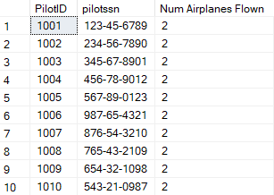
## Q10
We select the top 1 hangar from the hangar table ordered by its remaining capacity by counting the number of planes stored in the hangar, and then subtracting it from the total capacity of the airplane based on innder joins between hangar and airplane on the hangar number
```
select top 1 hangar.location,hangar.capacity, hangar.capacity - count(airplane.stored_in) as 'Available Space'
from hangar inner join airplane on hangar.number = airplane.stored_in
group by hangar.location, hangar.capacity
order by [Available Space] desc
```

## Q11
Join corporation table with airplane and then count the number of airplanes which are owned grouped by the corporation info in order to find how many each corporation has
```
select CORPORATION.name, CORPORATION.Address, CORPORATION.Phone, count(airplane.owned_by) as 'Planes Owned'
from CORPORATION inner join OWNERs on CORPORATION.Name = OWNERs.corporationID 
inner join airplane on airplane.owned_by = OWNERs.OWNERID
group by CORPORATION.name, CORPORATION.Address, CORPORATION.Phone
```

## Q12
In order to find average number of maintenance hours per plane type, we select avg of the hours from the airoplane and plane service table joined and then group by the type of airplane
```
select airplane.of_type, avg(PLANE_SERVICE.hours) as 'Average Hours of Maintainence'
from airplane inner join PLANE_SERVICE on PLANE_SERVICE.Reg# = airplane.RegNum
group by airplane.of_type
```
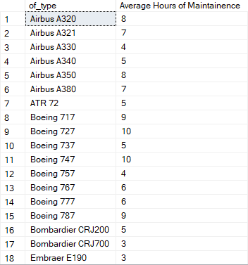
## Q13
This one was tricky too. We use case to make sure we write correct corporation/person name and ten left join person and corporation to make sure we get all values of table and they are not omitted (as in owner table one field will always be null of person or coporation, depending on flag). The rest are inners joins and finally our condition is to check the non existance of the employee in the works on table for that specific plane.
```
SELECT DISTINCT
    CASE
        WHEN o.Is_Corporation = 0 THEN p.FName
        ELSE c.Name
    END AS OwnerName
FROM OWNERS o
LEFT JOIN PERSON p ON o.personID = p.Ssn
LEFT JOIN CORPORATION c ON o.corporationID = c.Name
INNER JOIN airplane a ON o.OWNERID = a.owned_by
INNER JOIN PLANE_SERVICE ps ON a.RegNum = ps.Reg#
INNER JOIN PLANE_TYPE pt ON a.of_type = pt.Model
WHERE NOT EXISTS (
    SELECT 1
    FROM works_on wo
    INNER JOIN EMPLOYEE e ON wo.assigned_employee = e.EID
    WHERE wo.modelNum = pt.Model AND e.Ssn = ps.employeeID
);
```

## Q14
This question was worded a bit oddly, but I implemented this by using a plethora of jjoins which are repeated as well. So there are two airplane table joins (one for person and one for corporation etc). The where condition basically checks that each owner table (for person and corporaiton) both have the same hangar number for the planes they have based on one being person, and the other being corporation
```
SELECT
    p.FName AS PersonName,
    corp.Name AS CorporationName,
    h.number AS HangarNumber
FROM AIRPLANE ap1
INNER JOIN OWNERS o1 ON ap1.owned_by = o1.OWNERID
INNER JOIN PERSON p ON o1.personID = p.Ssn
INNER JOIN HANGAR h ON ap1.stored_in = h.number
INNER JOIN AIRPLANE ap2 ON h.number = ap2.stored_in
INNER JOIN OWNERS o2 ON ap2.owned_by = o2.OWNERID
INNER JOIN CORPORATION corp ON o2.corporationID = corp.Name
WHERE o1.Is_Corporation = 0 AND o2.Is_Corporation = 1;
```

## Q15
In order to do this, I had to introduce another column in airplane which was "Under Maintenance" which tracked whetehr the maintenance was complete or not. If it was, then its no else yes. So we join all the relevant tables in order to retreieve pilot info and then check Under maintenance is yes to find out which pilots can fly planes which are currently under maintanence.
```
select distinct pilot.PilotID, person.FName, airplane.of_type
from PLANE_SERVICE inner join airplane on plane_service.reg# = airplane.RegNum
inner join flies on FLIES.model = airplane.of_type
inner join pilot on FLIES.pid = pilot.pilotssn
inner join PERSON on PERSON.Ssn = pilot.pilotssn
where airplane.Under_Maintanence = 'Yes'
```
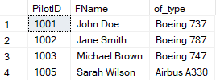
## Q16
In order to do this we summed the total service hours on a plane which were grouped by the employess names which were extracted from multiple joins which allowed us to access the employees name as well as the corporation they did the work for
```
select person.FName, person.Ssn, CORPORATION.Name, sum(PLANE_SERVICE.hours) as totalHours
from PERSON inner join EMPLOYEE on person.Ssn = EMPLOYEE.Ssn 
inner join PLANE_SERVICE on PLANE_SERVICE.employeeID = EMPLOYEE.EID 
inner join airplane on airplane.RegNum = PLANE_SERVICE.Reg#
inner join OWNERs on airplane.owned_by = OWNERs.OWNERID
inner join CORPORATION on OWNERs.corporationID = CORPORATION.Name 
group by PERSON.FName, person.Ssn, CORPORATION.Name
order by totalHours desc
```

## Q17
We selected the type and regnum of the airplanes by joining plane service, airplane, and employee and then in the where we checked that either owner is a person (so they are not corporation) or they have been worked on in the day shift using employee shift info
```
select airplane.of_type, airplane.RegNum 
from airplane inner join OWNERs on OWNERs.OWNERID = airplane.owned_by
inner join PLANE_SERVICE on airplane.RegNum = PLANE_SERVICE.Reg#
inner join EMPLOYEE on EMPLOYEE.EID = PLANE_SERVICE.employeeID
where OWNERs.Is_Corporation = 0 or EMPLOYEE.ShiftInfo = 'Day'
```
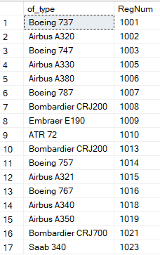
## Q18
This was the hardest query as it was so long due to me having multiple tables of person and corporation. Here I used the WITH command in order to create 2 seperate tables which contained airplanes purchased by persons/corporations in the last month. These two tables were then used in the final query to check for the existance of a record where the corporation purchases had a same plane as person purchasses within the last month using where clause
```
WITH CorporationPurchases AS (
    SELECT 
        a.of_type AS PlaneType,
        a.purchaseDate,
        o.OWNERID
    FROM AIRPLANE a
    INNER JOIN OWNERS o ON a.owned_by = o.OWNERID
    WHERE o.Is_Corporation = 1
        AND a.purchaseDate >= DATEADD(month, -1, GETDATE())
),
OwnerPlanes AS (
    SELECT
        a.RegNum,
        a.of_type AS PlaneType,
        a.purchaseDate,
        o.OWNERID
    FROM AIRPLANE a
    INNER JOIN OWNERS o ON a.owned_by = o.OWNERID
    WHERE o.Is_Corporation = 0
)

SELECT DISTINCT
    p.FName AS Name,
    p.FAddress AS Address
FROM PERSON p
INNER JOIN OWNERS o ON p.Ssn = o.personID
INNER JOIN OwnerPlanes op ON o.OWNERID = op.OWNERID
WHERE EXISTS (
    SELECT 1
    FROM CorporationPurchases cp
    WHERE cp.PlaneType = op.PlaneType
        AND cp.purchaseDate >= DATEADD(month, -1, GETDATE())
);
```

## Q19
Pretty simple as we join hangar with airplane then count the airplanes whicha are stored in the hangars and group them by the hangar number and location
```
select hangar.number, hangar.location, count(airplane.stored_in) as 'Number of Planes'
from hangar inner join airplane on hangar.number = airplane.stored_in
group by hangar.number, hangar.location
```
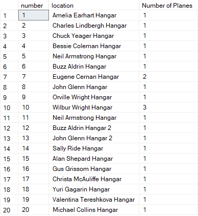
## Q20
Again, pretty simlple as we simply join airplane and plane type and then count the oftype colun of airplane table and group it by the plane type models
```
select PLANE_TYPE.Model, count(airplane.of_type) as 'Total number of planes'
from PLANE_TYPE inner join airplane on PLANE_TYPE.Model = airplane.of_type
group by PLANE_TYPE.Model
```

## Q21
In this query, we join plane service with airplane and count the number of reg#s in the plane service table grouped by the airplane reg# in order to see how many services were performed on each plane
```
select airplane.RegNum, airplane.of_type, count(PLANE_SERVICE.Reg#) as 'Services Performed on Each Plane'
from airplane inner join PLANE_SERVICE on airplane.RegNum = PLANE_SERVICE.Reg#
group by airplane.RegNum, airplane.of_type
```

## Q22
NO joins required, we simply get avg salary from function grouped by shiftinfo (Day or Night)
```
select EMPLOYEE.ShiftInfo, avg(EMPLOYEE.Salary) as 'Average Salary According to Shift'
from EMPLOYEE group by EMPLOYEE.ShiftInfo
```
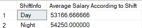
## Q23
A case is used to ensure person/corpoation is correctly named, after which left joins are used on airplane and corporation in order to ensure that null values are not omitted as owner table will always have some null values for either person (if it is corporaiton) and vice versa. We count the plane registration numbers and group by owner info to get our result.
```
select
    CASE
        WHEN OWNERs.Is_Corporation = 0 THEN PERSON.FName
        ELSE CORPORATION.Name
    END AS Name,
count(airplane.RegNum) as 'Total Planes Owned'
from OWNERs inner join airplane on OWNERs.OWNERID = airplane.owned_by
left join person on person.Ssn = OWNERs.personID
left join CORPORATION on CORPORATION.Name = OWNERs.corporationID
group by OWNERs.Is_Corporation, person.FName, CORPORATION.Name
```

## Q24
We join the flies and pilot table and count the model of planes grouped by the pilotid in order to get the result
```
select PILOT.PilotID, count(FLIES.model) as 'Can fly N Planes'
from PILOT inner join FLIES on PILOT.pilotssn = FLIES.pid
group by PILOT.PilotID 
```
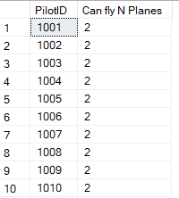
## Q25
### Query 1:
>Query to find total amount of salary being paid by airport to employees\
>It is important in order to generate pay slips and calculate expenses etc\
This was done by selecing the sum of salaries from the employee table
```
select sum(EMPLOYEE.Salary) as 'Total Salary Expense of Airport'
from EMPLOYEE 
```
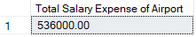
### Query 2:
>Query to find total number of maintainence hours worked by each employee\
>It is important for monitoring employee productivity, scheduling work shifts, and determining workloads\
We do this by summing the hours attribute of plane service table from the joined tables of person, planeservice, and group them by employee information
```
SELECT 
    EMPLOYEE.EID, 
    PERSON.FName, 
    SUM(plane_service.hours) AS TotalHours
FROM EMPLOYEE
INNER JOIN PERSON ON EMPLOYEE.Ssn = PERSON.Ssn
INNER JOIN PLANE_SERVICE ON EMPLOYEE.EID = PLANE_SERVICE.employeeID
GROUP BY EMPLOYEE.EID, PERSON.FName;
```
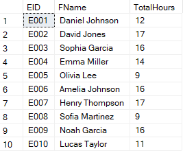
### Query 3:
>Query to find out number of pilots with each restriction\
>This is imporant for managing and assigning pilots according to their qualifications and limitations\
we join the pilot and pilotrestriction table on pilot id and then count the pilotids in the restrcitions table grouped by each restriction
```
select pilot_restrictions.restriction as Restriction, count(pilot.pilotid) as 'Number of Pilots'
from pilot_restrictions inner join PILOT on PILOT.PilotID = pilot_restrictions.pilotID
group by pilot_restrictions.restriction
```
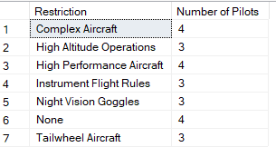
### Query 4:
>Query to find contact information of all non corporation owners\
>This is important to to maintain up-to-date contact information for their individual clients\
This is implmeneted by joining owners with person table and displayinng person info where owner isCorpoation = 0
```
SELECT 
    FName AS Name, 
    FAddress AS Address, 
    Phone
FROM PERSON
INNER JOIN OWNERS o ON PERSON.Ssn = o.personID
WHERE o.Is_Corporation = 0;
```

### Query 5:
>Query to find the airplane models with a capacity greater than a specific value\
>Ths is important to scheduele flights which have a specific capacity requirment to ensure safety\ 
simply select model and capacity from planetype table where capacity is greater than a specicific value.
```
SELECT 
    Model, 
    Capacity
FROM PLANE_TYPE
WHERE Capacity > 500;
```
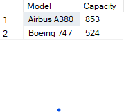
